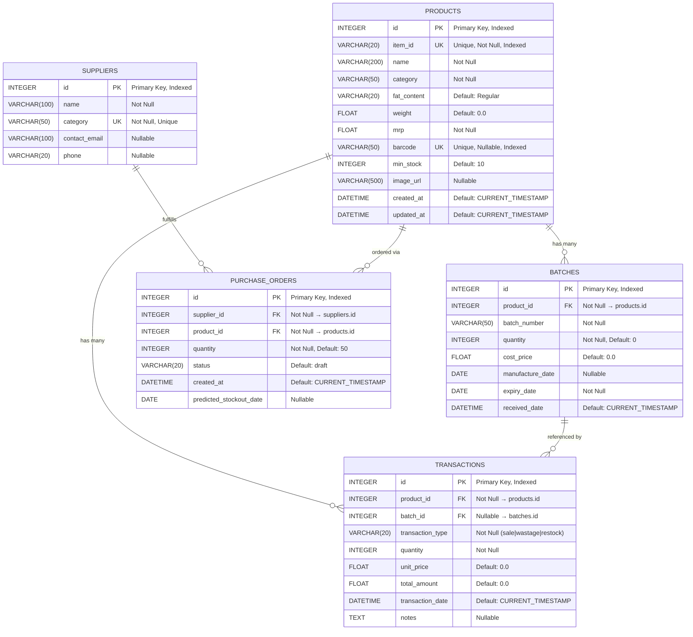

# 📊 Database Schema Documentation

**Smart Campus Store — Inventory & Expiry Tracker**

- **Database Engine:** SQLite (development) / PostgreSQL-ready (production)
- **ORM:** SQLAlchemy 2.0
- **Schema Source:** `backend/models.py`
- **Generated:** 2026-02-12

---

## 🗂️ Entity-Relationship Diagram



---

## 📋 Table Descriptions

| Table | Purpose | Record Count |
|---|---|---|
| **`products`** | Master product catalog. One entry per unique product (e.g., "Amul Milk 500ml"). Stores pricing, category, barcode, and stock thresholds. | 300 |
| **`batches`** | Batch-level inventory tracking. Each restock creates a new batch with its own quantity, cost price, manufacture date, and expiry date. Enables FIFO selling and per-batch expiry monitoring. | 505 |
| **`transactions`** | Records all inventory movements — sales, wastage log entries, and restocks. Each transaction links to a product and optionally to a specific batch. | 13 |
| **`suppliers`** | Registered suppliers, one per product category. Used by the ML engine to auto-generate purchase orders. | 9 |
| **`purchase_orders`** | ML-generated purchase order drafts. Automatically created when the system predicts a stock-out within 48 hours based on sales velocity. | 1 |

---

## 🔗 Relationships

### One-to-Many Relationships

| Parent Table | Child Table | Foreign Key | Cascade | Description |
|---|---|---|---|---|
| `products` | `batches` | `batches.product_id → products.id` | `ALL, DELETE-ORPHAN` | A product has many inventory batches. Deleting a product removes all its batches. |
| `products` | `transactions` | `transactions.product_id → products.id` | `ALL, DELETE-ORPHAN` | A product has many transactions. Deleting a product removes all its transaction history. |
| `batches` | `transactions` | `transactions.batch_id → batches.id` | None | A transaction may optionally reference a specific batch (e.g., wastage from a particular batch). |
| `suppliers` | `purchase_orders` | `purchase_orders.supplier_id → suppliers.id` | None | A supplier can have many purchase orders. |
| `products` | `purchase_orders` | `purchase_orders.product_id → products.id` | None | A product can have many purchase orders over time. |

### Visual Summary

```
products ─┬──< batches          (1 product → many batches)
          ├──< transactions     (1 product → many transactions)
          └──< purchase_orders  (1 product → many POs)

batches ────< transactions      (1 batch → many transactions, optional)

suppliers ──< purchase_orders   (1 supplier → many POs)
```

---

## 🔑 Primary Keys

| Table | Column | Type | Auto-Increment |
|---|---|---|---|
| `products` | `id` | INTEGER | ✅ Yes |
| `batches` | `id` | INTEGER | ✅ Yes |
| `transactions` | `id` | INTEGER | ✅ Yes |
| `suppliers` | `id` | INTEGER | ✅ Yes |
| `purchase_orders` | `id` | INTEGER | ✅ Yes |

---

## 🔐 Foreign Keys

| Table | Column | References | Nullable | On Delete |
|---|---|---|---|---|
| `batches` | `product_id` | `products.id` | ❌ Not Null | CASCADE (via ORM) |
| `transactions` | `product_id` | `products.id` | ❌ Not Null | CASCADE (via ORM) |
| `transactions` | `batch_id` | `batches.id` | ✅ Nullable | No action |
| `purchase_orders` | `supplier_id` | `suppliers.id` | ❌ Not Null | No action |
| `purchase_orders` | `product_id` | `products.id` | ❌ Not Null | No action |

---

## 📇 Indexes

| Table | Index Name | Column(s) | Unique |
|---|---|---|---|
| `products` | `ix_products_id` | `id` | ❌ |
| `products` | `ix_products_item_id` | `item_id` | ✅ |
| `products` | `ix_products_barcode` | `barcode` | ✅ |
| `batches` | `ix_batches_id` | `id` | ❌ |
| `transactions` | `ix_transactions_id` | `id` | ❌ |
| `suppliers` | `ix_suppliers_id` | `id` | ❌ |
| `purchase_orders` | `ix_purchase_orders_id` | `id` | ❌ |

---

## 🛡️ Unique Constraints

| Table | Column | Constraint Type |
|---|---|---|
| `products` | `item_id` | UNIQUE INDEX |
| `products` | `barcode` | UNIQUE INDEX (nullable) |
| `suppliers` | `category` | UNIQUE CONSTRAINT |

---

## 🏷️ Enums (Application-Level)

### `ItemCategory`
Used for `products.category` (validated in application, stored as VARCHAR):

| Value | Description |
|---|---|
| `Soft Drinks` | Beverages & sodas |
| `Canned` | Canned goods |
| `Dairy` | Milk, cheese, yogurt |
| `Baking Goods` | Flour, sugar, baking items |
| `Frozen Foods` | Frozen meals & ingredients |
| `Fruits & Vegetables` | Fresh produce |
| `Snack Foods` | Chips, cookies, snacks |
| `Household` | Cleaning, kitchen supplies |
| `Health and Hygiene` | Personal care products |

### `TransactionType`
Used for `transactions.transaction_type`:

| Value | Description |
|---|---|
| `sale` | Product sold to customer (deducts stock via FIFO) |
| `wastage` | Expired/damaged product logged as waste |
| `restock` | New batch received from supplier |

### `PurchaseOrder.status`
Used for `purchase_orders.status`:

| Value | Description |
|---|---|
| `draft` | ML-generated, awaiting review |
| `sent` | Sent to supplier |
| `received` | Order fulfilled and stock received |

---

## 🧮 Computed Properties (ORM-Level)

These are **not stored in the database** but computed dynamically via SQLAlchemy:

| Model | Property | Logic |
|---|---|---|
| `Product` | `total_stock` | `SUM(batch.quantity)` for all batches where `quantity > 0` |
| `Batch` | `expiry_status` | Returns `expired` / `critical` / `warning` / `fresh` based on days until expiry |
| `Batch` | `days_until_expiry` | `(expiry_date - today).days` |

---

## 📐 Default Values

| Table | Column | Default |
|---|---|---|
| `products` | `fat_content` | `"Regular"` |
| `products` | `weight` | `0.0` |
| `products` | `min_stock` | `10` |
| `products` | `created_at` | `CURRENT_TIMESTAMP` |
| `products` | `updated_at` | `CURRENT_TIMESTAMP` (auto-updates) |
| `batches` | `quantity` | `0` |
| `batches` | `cost_price` | `0.0` |
| `batches` | `received_date` | `CURRENT_TIMESTAMP` |
| `transactions` | `unit_price` | `0.0` |
| `transactions` | `total_amount` | `0.0` |
| `transactions` | `transaction_date` | `CURRENT_TIMESTAMP` |
| `purchase_orders` | `quantity` | `50` |
| `purchase_orders` | `status` | `"draft"` |
| `purchase_orders` | `created_at` | `CURRENT_TIMESTAMP` |
